# Secure Static Website Hosting on AWS

## Scenario — What Problem Are We Solving?

A small business needs a fast, secure, publicly accessible website 
without the cost and complexity of managing a web server. Traditional 
server hosting requires ongoing maintenance, patching, and 
infrastructure management, resources a small business cannot 
justify for a static site. The solution must deliver content 
globally over HTTPS, protect storage from direct public exposure, 
and ensure only authorized users can update content.

This project demonstrates a production-grade static website hosting 
architecture on AWS using S3, CloudFront, IAM, and CloudWatch which 
implements defense in depth with security controls enforced at 
every layer of the stack.

---

## Architecture

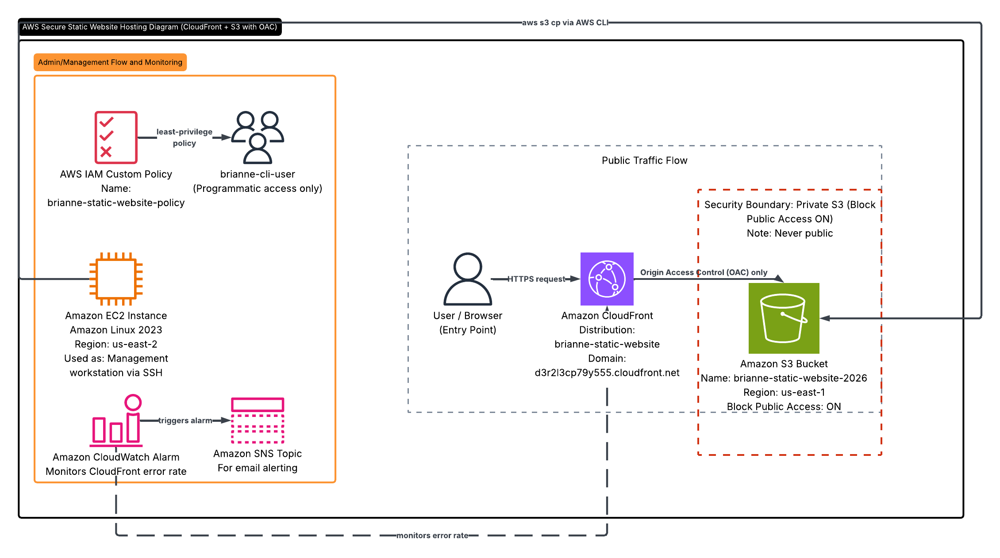
*Secure static website hosting architecture - S3 origin kept private, all traffic routed through CloudFront with Origin Access Control*

---

## AWS Services Used

- **Amazon S3** — private object storage for website files
- **Amazon CloudFront** — CDN with HTTPS enforcement and Origin Access Control
- **AWS IAM** — custom least-privilege policy for CLI user
- **Amazon EC2 (Linux)** — management workstation for AWS CLI over SSH
- **Amazon CloudWatch** — error rate monitoring and SNS alerting
- **Amazon SNS** — email notification for CloudWatch alarms

---

## Obstacles — Constraints and Security Requirements

Several constraints shaped the architectural decisions in this project:

**The S3 bucket must never be public.** A common mistake is enabling 
public access on an S3 bucket to host a website. This exposes storage 
directly to the internet with no protection. The correct approach is 
keeping the bucket private and routing all traffic through CloudFront.

**CloudFront must be the only entity that can read from the bucket.** 
Origin Access Control was configured so that only the specific 
CloudFront distribution (which is identified by its exact ARN) can read 
from the bucket. Not any CloudFront distribution, not a browser, 
not any other AWS service. Just this one distribution.

**The CLI user must follow least privilege.** The IAM user created 
for CLI access was initially given AmazonS3FullAccess which violates 
the principle of least privilege. This was replaced with a custom 
policy restricting access to a single bucket and four specific 
actions: PutObject, GetObject, DeleteObject, and ListBucket.

**All work must be performed as an IAM user, not root.** AWS best 
practice requires the root account to be locked away after initial 
setup. An IAM admin user was created for all console work. 
The root account is not used for any operational tasks.

---

## Actions — What Was Built and Why

### Step 1 — SSH into EC2 Linux Instance

SSH'd into an Amazon Linux EC2 instance from a Mac terminal using 
key pair authentication. All file creation and AWS CLI work was 
performed from inside this remote Linux server, not from a local 
machine or the AWS console.

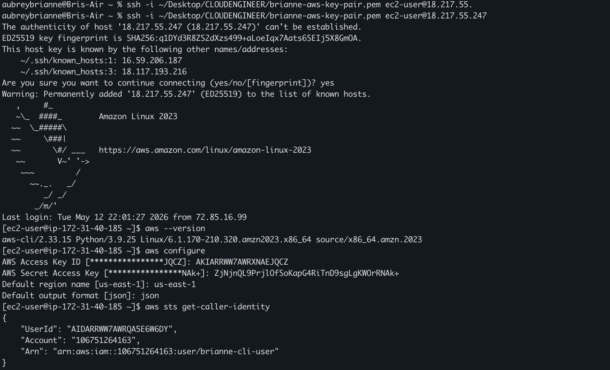

---

### Step 2 — Create a Private S3 Bucket

Created a private S3 bucket in us-east-1 with Block Public Access 
fully enabled. The bucket was never made public at any point during 
this project.

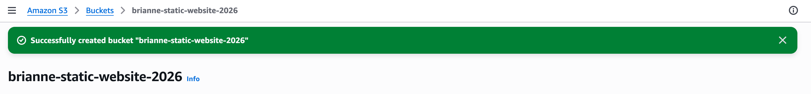

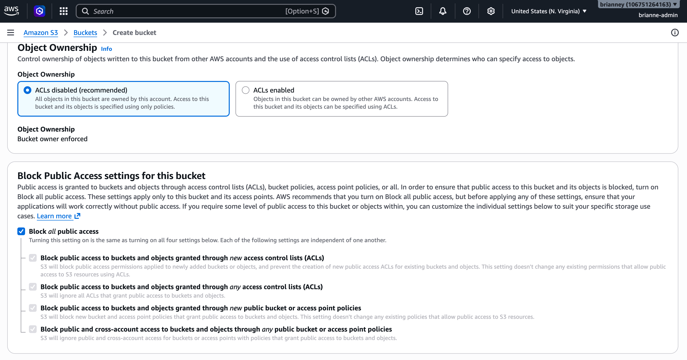

---

### Step 3 — Upload index.html via AWS CLI

Configured the AWS CLI on the EC2 instance with brianne-cli-user's 
access keys and uploaded index.html to the S3 bucket using the 
AWS CLI —-> no console uploads. This replicates a real-world 
infrastructure management workflow.

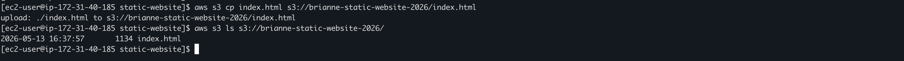

---

### Step 4 — Create CloudFront Distribution with OAC

Created a CloudFront distribution with Origin Access Control 
configured so only this specific distribution can read from the 
private S3 bucket. Set the viewer protocol policy to Redirect 
HTTP to HTTPS.

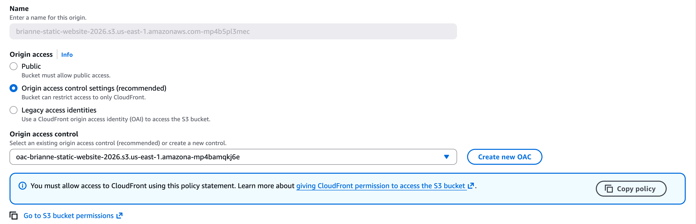

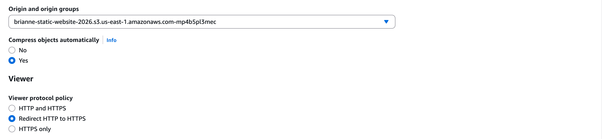

---

### Step 5 — Update S3 Bucket Policy

Copied the OAC scoped bucket policy from CloudFront and applied 
it to the S3 bucket. This policy restricts bucket access to only 
the specific CloudFront distribution by ARN — more secure than a 
general CloudFront service policy.

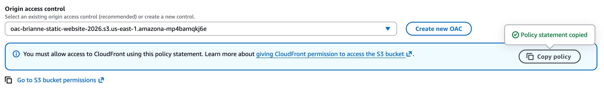

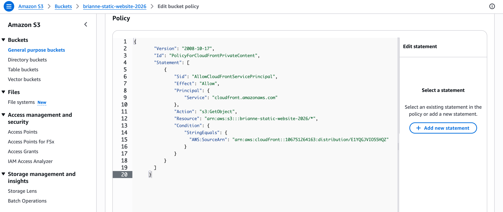

---

### Step 6 — Implement Least Privilege IAM Policy

Identified that brianne-cli-user had AmazonS3FullAccess which 
violates least privilege. Created a custom IAM policy named 
brianne-static-website-policy that restricts the user to four 
specific actions on one specific bucket only. Removed the broad 
managed policy and attached the custom one.

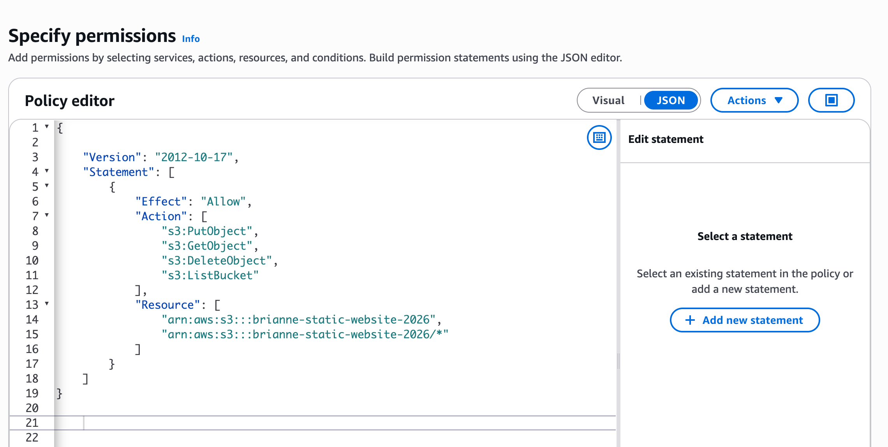

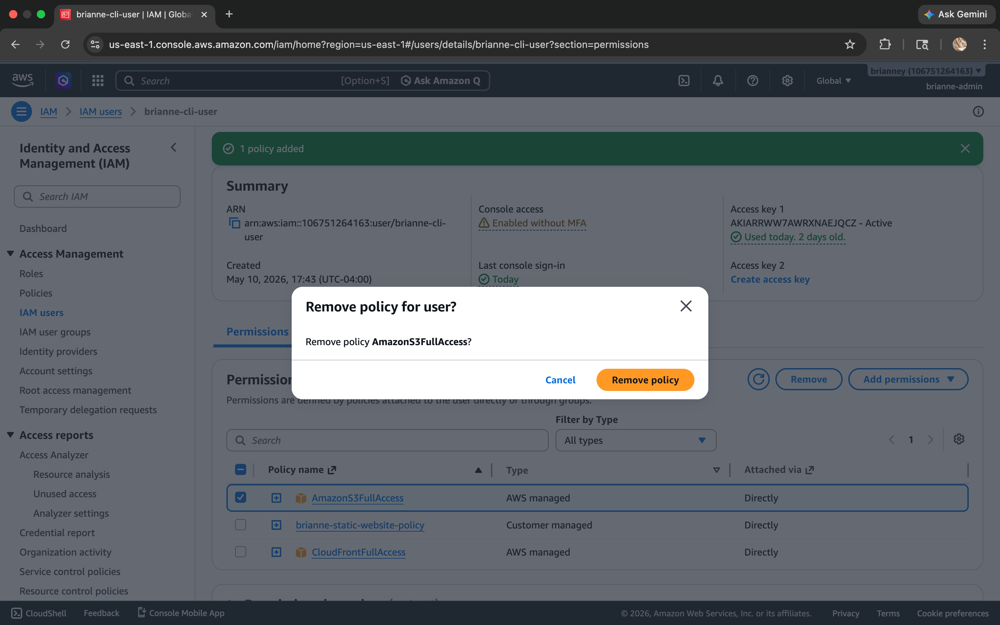

---

### Step 7 — Configure CloudWatch Monitoring

Created a CloudWatch alarm monitoring the CloudFront error rate 
with an SNS topic for email notification so delivery failures 
are caught proactively before users are affected.

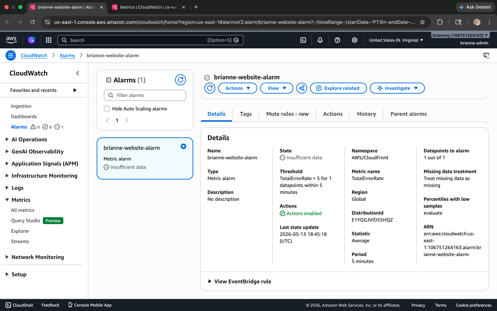

---

## Results — What the Working System Demonstrates

The website loads successfully through the CloudFront URL over 
HTTPS with a valid SSL certificate. Direct access to the S3 
bucket URL returns Access Denied which confirms the security 
architecture is working exactly as designed. Content is only 
accessible through CloudFront.

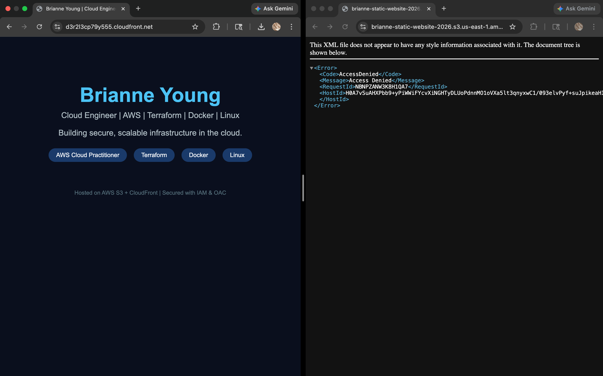

---

## Troubleshooting — Real Issues Encountered and Resolved

**Issue 1 — Working from the root account**
Initially began the lab while logged in as the root user. Recognized 
this violated AWS security best practices before proceeding further. 
Stopped, created a dedicated IAM admin user, and completed all 
remaining work from that user. The root account was not used for 
any operational tasks after that point.

**Issue 2 — Region mismatch between EC2 and S3**
The EC2 instance was created in us-east-2 (Ohio) while the AWS CLI 
was configured to us-east-1 (N. Virginia). After investigation, 
confirmed these are two separate concerns. The EC2 instance region 
determines where the server physically lives, while the CLI region 
determines where CLI commands are sent. The upload completed 
successfully with no errors. For production environments, keeping 
EC2 and S3 in the same region is recommended to eliminate 
cross-region data transfer costs and reduce latency. For this lab 
environment the impact was negligible.

**Issue 3 — Broad IAM permissions violating least privilege**
brianne-cli-user was initially given AmazonS3FullAccess, which is a broad 
AWS managed policy that allows creating, deleting, and modifying 
any S3 bucket in the account. I quickly recognized this was excessive for 
a user that only needs to upload files to one specific bucket. 
I then created a custom policy scoped to a single bucket and four 
specific actions. AWS managed policies should never be edited 
directly, and a new custom policy was created instead.

---

## Security Implementation Summary

| Layer | Control | Purpose |
|---|---|---|
| S3 Bucket | Block Public Access enabled | Prevents any public bucket access |
| S3 Bucket | OAC scoped bucket policy | Only this specific CloudFront distribution can read |
| CloudFront | Origin Access Control | Enforces private S3 access |
| CloudFront | Redirect HTTP to HTTPS | All traffic encrypted in transit |
| IAM | Custom least-privilege policy | CLI user restricted to one bucket, four actions |
| IAM | No console access for CLI user | Programmatic access only |
| Account | IAM admin user for all operations | Root account not used for operational tasks |

---

## Key Learnings

- Security in cloud architecture is about layers (defense in depth). Each control 
  adds one more barrier that must be bypassed independently.
- The difference between a general CloudFront bucket policy and 
  an OAC scoped policy is significant! An OAC scoped bucket policy locks access to a single specific 
  CloudFront distribution by ARN, which is far more secure than a general 
  CloudFront service policy that allows any distribution to read 
  from the bucket.
- AWS managed policies should never be edited directly! Always 
  create a custom policy when you need something more specific.
- The root account should be locked away immediately after 
  initial setup and never used for day to day operations.
- AWS CLI region configuration is independent of the region where 
  your EC2 instance lives — however for production environments, 
  keeping compute and storage in the same region eliminates 
  cross-region data transfer costs and reduces latency.

---

## Cleanup — Avoid Unnecessary AWS Charges

When you are done testing and exploring this project, clean up 
your AWS resources in the following order to avoid unexpected charges.

**Important:** Always disable and delete CloudFront before deleting 
the S3 bucket. Deleting S3 first while CloudFront still points to 
it will cause errors.

1. CloudFront → Distributions → select distribution → Disable 
   (wait 5-10 minutes for status to show Disabled)
2. CloudFront → Distributions → select distribution → Delete
3. S3 → select bucket → Empty bucket → confirm
4. S3 → select bucket → Delete bucket → confirm
5. IAM → Users → brianne-cli-user → Security credentials → 
   Deactivate and delete access keys
6. IAM → Policies → brianne-static-website-policy → Delete
7. CloudWatch → Alarms → delete alarm
8. SNS → Topics → delete topic

All services used in this project are free tier eligible. 
If cleanup is completed promptly after testing, no charges 
should appear on your AWS bill.

---

## Let's Connect!
Brianne Young | Cloud Engineer | 
[LinkedIn](https://www.linkedin.com/in/brianne-young0/) | 
[GitHub](https://github.com/brianne-y)
